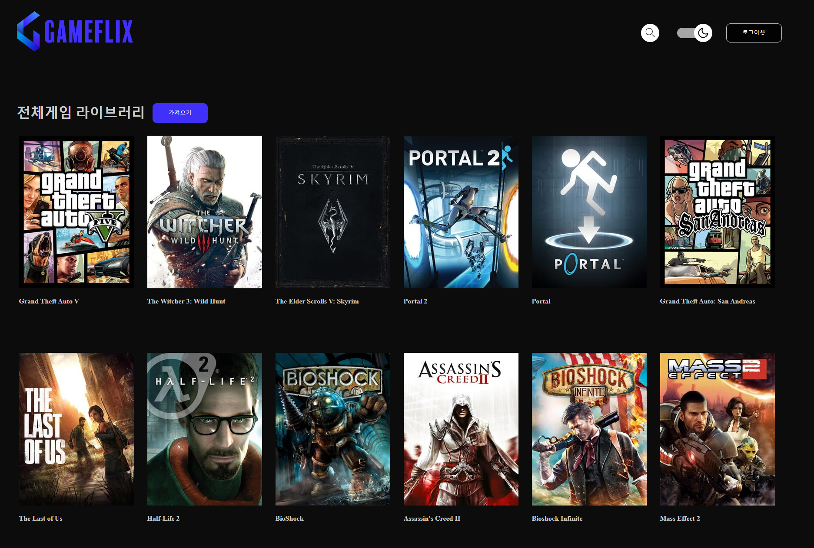
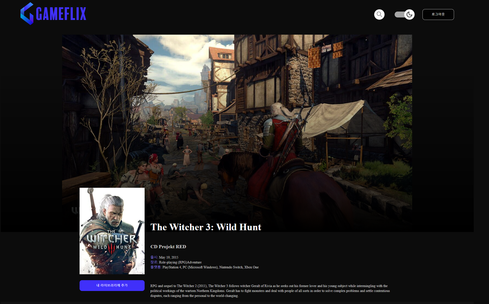
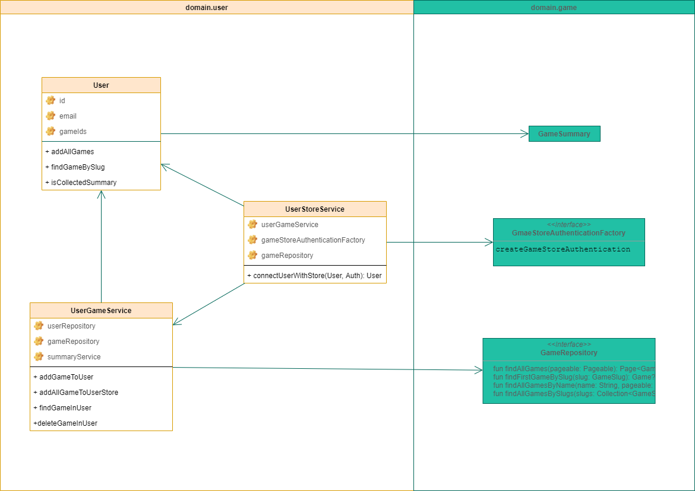
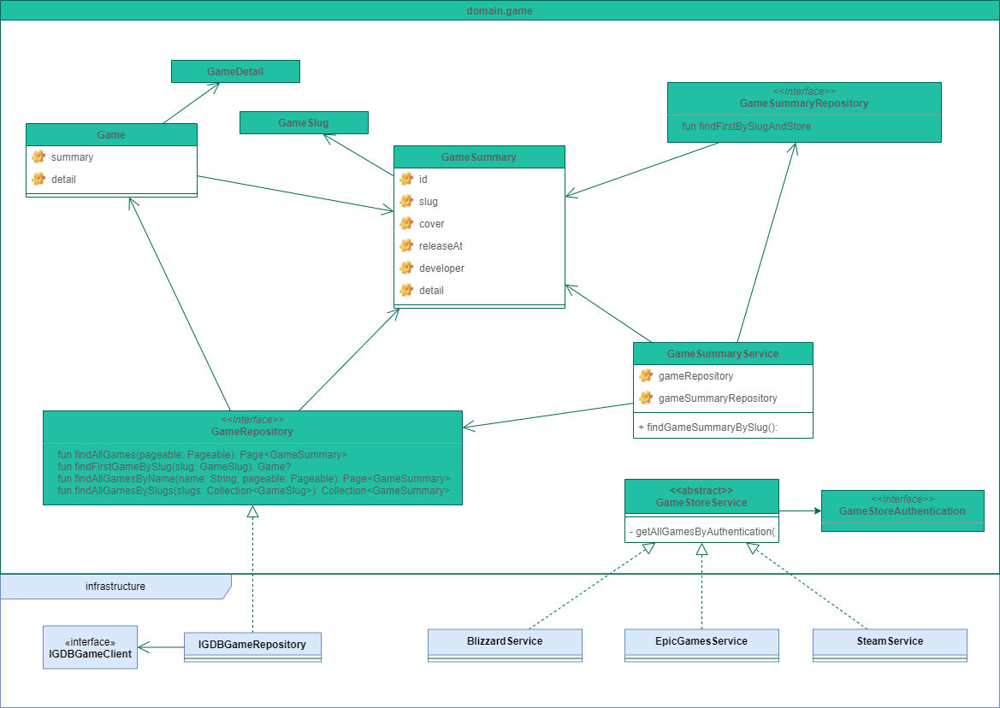
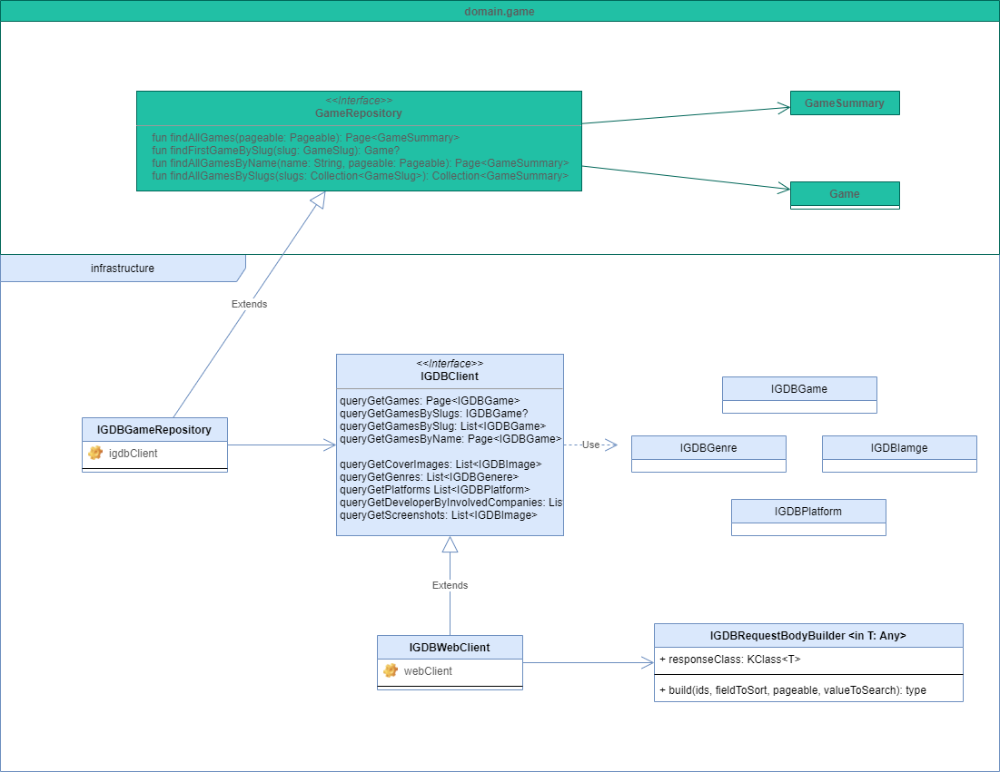

# [Gameflix](https://www.gameflix.link/)

[]

Gameflix backend Service using Spring Boot with Kotlin

## Description





### Key Features

- Login with Google using OpenID Connect
- Connect Steam games using Oauth2.0
- Connect Blizzard games using Oauth 2.0
- Search and add games for your flavor

### Documents

- [API Documents - Swagger UI](https://opgg-hackthon.github.io/gameflix/)
- [Frontend Application - Github](https://github.com/OPGG-HACKTHON/gameflix-frontend)
    - [Frontend Stroybook](https://opgg-hackthon.github.io/gameflix-frontend/)

## Getting Started

### From live server

``` shell
$ curl --location --request GET 'https://www.gameflix-backend.com/games?page=0&size=10'
```

- Live server with UI is [here](https://www.gameflix.link/)

### From source code

``` shell
$ git clone https://github.com/OPGG-HACKTHON/gameflix.git
```

```shell
$ gradelw bootRun
```

```shell
$ curl --location --request GET 'http://localhost:8080'
```

### From docker

```shell
$ docker pull ghcr.io/opgg-hackthon/gameflix:main
```

```shell
$ docker run --rm -p 8080:8080 ghcr.io/opgg-hackthon/gameflix:main
```

```shell
$ curl --location --request GET 'http://localhost:8080'
```

## Overview

### Design Principal

- Always test every package, class in codes
    - This is validated by jacoco-gradle-plugin
- Try to avoid including additional dependencies as much as possible
- Try to maintain codes in domain package remain pure kotlin code
    - Except for necessary spring annotations like `@RestController` `@Repository` `@Transactional`

### Diagrams

- You can open full diagram file in [gameflix.drawio](./doc/gameflix.drawio) using draw.io

#### Domain - User



- User is Google OpenID Connected User

#### Domain - Game



### Infrastructure - IGDB



## What can be done more

- User rates games

### Contact

You can contact me with [email](https://github.com/raeperd/realworld-springboot-java/blob/master/raeperd117@gmail.com)
or issue in this project

## Referenced

- [Working with the Container registry - GitHub Docs](https://docs.github.com/en/packages/working-with-a-github-packages-registry/working-with-the-container-registry#authenticating-to-the-container-registry)
- [Spring Boot Actuator: Production-ready Features](https://docs.spring.io/spring-boot/docs/current/reference/html/actuator.html#actuator.endpoints.info.build-information)
- [Spring Boot “How-to” Guides | 16.1 Generate Build Information](https://docs.spring.io/spring-boot/docs/current/reference/html/howto.html#howto.build.generate-info)

- [Using Spring Security 5 to integrate with OAuth 2-secured services such as Facebook and GitHub](https://spring.io/blog/2018/03/06/using-spring-security-5-to-integrate-with-oauth-2-secured-services-such-as-facebook-and-github)
- [Spring Security 5 - OAuth2 Login | Baeldung](https://www.baeldung.com/spring-security-5-oauth2-login)
- [Spring Security and OpenID Connect | Baeldung](https://www.baeldung.com/spring-security-openid-connect)
- [WebClient and OAuth2 Support | Baeldung](https://www.baeldung.com/spring-webclient-oauth2#springsecurity-internals)
- [Google Sign-In for Websites: Authentication with backends - YouTube](https://www.youtube.com/watch?v=j_31hJtWjlw&t=32s)
- [Authenticate with a backend server | Google Sign-In for Websites](https://developers.google.com/identity/sign-in/web/backend-auth)
- [Blizzard OAuth APIs | Documentation](https://develop.battle.net/documentation/battle-net/oauth-apis)
- [steam-user - npm](https://www.npmjs.com/package/steam-user)
- [skhamis/steam-game-picker: Allows you to use OpenID to sign in to your steam account and randomly choose games from your steam library using only React hooks](https://github.com/skhamis/steam-game-picker)


